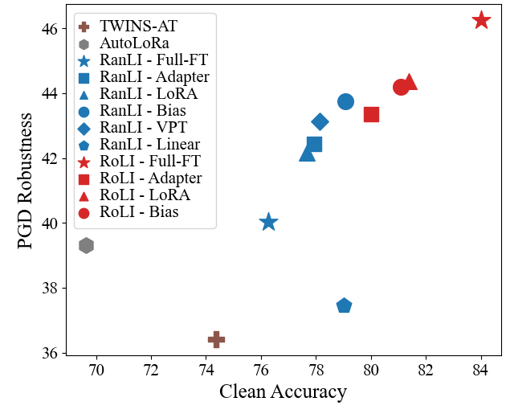

# RoLI

https://arxiv.org/abs/2312.05716

------
This repository contains the official PyTorch implementation for Robust Linear Initialization (RoLI).


<div style="text-align:center;">
    
</div>

## Environment settings
We provide the required pacakges in requirements.txt file. To use in a new Conda environment,
```bash
conda create --name roli python=3.8.17
conda activate roli
pip install -r requirements.txt
```

## Datasets preperation:

We use CIFAR-10 and CIFAR-100 from [Visual Task Adaptation Benchmark](https://google-research.github.io/task_adaptation/) (VTAB). Please see [`VTAB_SETUP.md`](https://github.com/KMnP/vpt/blob/main/VTAB_SETUP.md) for instructions. Note, only CIFAR-10 and CIFAR-100 are required. We follow the official train/test splits and the size of validation set is specified in [TRAIN_SPLIT_PERCENT](src/data/vtab_datasets/cifar.py) in code.

The train/val/test splits for other datasets are provided in [`data_splits`](data_splits). Copy the JSON file to the location where your dataset is downloaded.

- [Stanford Dogs](http://vision.stanford.edu/aditya86/ImageNetDogs/main.html).

- [CUB200 2011](https://data.caltech.edu/records/65de6-vp158).

- [Caltech256](https://data.caltech.edu/records/nyy15-4j048). 


## Adversarially robust/non-robust pretraining preperation:

Download and place the pretrained model to [`pretrain`](pretrain).

- Robust Pretrained Model:[ARES2.0](https://github.com/thu-ml/ares/tree/main/robust_training) for SwinB and ViTB.

- Non-robust Pretrained Model: For Swin Transformer(swin_base_patch4_window7_224), we use the weights from [official implementation](https://github.com/microsoft/Swin-Transformer). For ViT, we use the weights from [torch vision](https://download.pytorch.org/models/vit_b_16-c867db91.pth). 


## Training:

We provide training configs for both RoLI and RanLI. Our trained RoLI checkpoints can be found at [google drive](https://drive.google.com/drive/folders/1EGboFnNayP7s5HmgKJGbPvimLLxIrMq9).

Before training, make sure to set the OUTPUT_DIR and change the DATAPATH to the location where your dataset is downloaded.

### RanLI
For adversarially fully finetuning (RanLI-Full-FT) in CIFAR-10,
```bash
python train.py --config-file=configs/finetune/cifar10_ranli.yaml
```

To adversarially finetuning with PEFT, such as RanLI-LoRA in Stanford Dogs,
```bash
python train.py --config-file=configs/lora/stanforddogs_ranli.yaml
```

For adversarially linear probing (RanLI-Linear) in Caltech256,
```bash
python train.py --config-file=configs/linear/caltech256_ranli.yaml
```

### RoLI

RoLI includes two stage training: robust linear initialization and adversarially finetuning.

For RoLI-Full-FT in CIFAR-10, we first train RanLI-Linear. After training, two checkpoints are saved: the best validation performance checkpoint `best_model.pth`, and the last checkpoint `last_model.pth`. Next, we set the WEIGHT_PATH to the location of `best_model.pth`. Finally, we perform adversarial full finetuning in CIFAR-10.

```bash
python train.py --config-file=configs/linear/cifar10_ranli.yaml
# Set WEIGHT_PATH in finetune/cifar10_roli.yaml to the path of RanLI-Linear trained checkpoint best_model.pth.
python train.py --config-file=configs/finetune/cifar10_roli.yaml
```

Similarly, to train the RoLI-Bias in CUB200,
```bash
python train.py --config-file=configs/linear/cub_ranli.yaml
# Set WEIGHT_PATH in bias/cub_roli.yaml to the path of RanLI-Linear trained checkpoint best_model.pth.
python train.py --config-file=configs/bias/cub_roli.yaml
```

## Testing:

To test, set SOLVER.TOTAL_EPOCH to 0 and set WEIGHT_PATH to the checkpoint location in the config file. 

We provide one sample [`test config`](configs/adapter/stanforddogs_roli_eval.yaml) to evaluate RoLI-Adapter in Stanford Dogs,
```bash
python train.py --config-file=configs/adapter/stanforddogs_roli_eval.yaml
```

To test with AutoAttack, 
```bash
python autoattack.py --config-file=configs/adapter/stanforddogs_roli_eval.yaml
```

## Citation:
If you find our work helpful in your research, please cite it as:

```
@article{hua2023initialization,
  title={Initialization Matters for Adversarial Transfer Learning},
  author={Hua, Andong and Gu, Jindong and Xue, Zhiyu and Carlini, Nicholas and Wong, Eric and Qin, Yao},
  journal={arXiv preprint arXiv:2312.05716},
  year={2023}
}
```
## Acknowledgement:
This rebo is built on [VPT](https://github.com/KMnP/vpt).